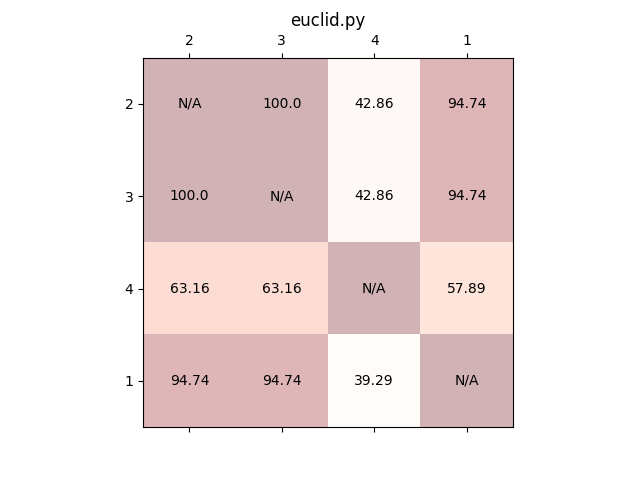

.. _quickstart:

Quick start guide
=================

This guide implements a simple assessment to make a *greatest common denominator* function.

First make an assessment yaml file:

.. literalinclude:: _static/QuickStart/simple_assessment.yml
    :linenos:
    :language: yaml

This expects a single function called ``gcd()`` in a file called ``euclid.py`` with no fewer
than two arguments. It expects it to print ``4`` to stdout when executed. It also runs pytest
on the function.

Then add it to the database:

.. code-block:: bash

    docker run -v "$(pwd)/docs/source/_static/QuickStart/simple_assessment.yml":/tmp/assessment.yml -it --entrypoint python --rm smarker assessments.py -c /tmp/assessment.yml

.. warning::

    If using windows, I recommend using the mingw shell since powershell is bad at dealing with relative file paths. With mingw you can simply use ``$(pwd)``.

    However, if you do, be sure to **escape file paths properly**; since, for example, ``/tmp/`` will automatically be expanded to ``C:/Users/<user>/AppData/Local/Temp/``. This causes issues when 
    setting up docker volumes. You can prefix your commands with ``MSYS_NO_PATHCONV=1`` (`see the documentation <https://web.archive.org/web/20201112005258/http://www.mingw.org/wiki/Posix_path_conversion>`_).

Then add some students:

.. code-block:: bash

    docker run -v "$(pwd)/docs/source/_static/QuickStart/simple_assessment.yml":/tmp/assessment.yml -it --entrypoint python --rm smarker assessments.py -s "1,Alice,a.bar@uea.ac.uk"
    docker run -v "$(pwd)/docs/source/_static/QuickStart/simple_assessment.yml":/tmp/assessment.yml -it --entrypoint python --rm smarker assessments.py -s "2,Bob,b.bar@uea.ac.uk"
    docker run -v "$(pwd)/docs/source/_static/QuickStart/simple_assessment.yml":/tmp/assessment.yml -it --entrypoint python --rm smarker assessments.py -s "3,Christina,c.bar@uea.ac.uk"
    docker run -v "$(pwd)/docs/source/_static/QuickStart/simple_assessment.yml":/tmp/assessment.yml -it --entrypoint python --rm smarker assessments.py -s "4,Dan,d.bar@uea.ac.uk"

Now we are ready to make some reports! The submissions are zip files with the student's id as the name. First lets just use the default parameters:

.. code-block:: bash

    docker run -v "$(pwd)/docs/source/_static/QuickStart/1.zip":/tmp/1.zip -e submission=/tmp/1.zip -e assessment=simple_assessment --rm smarker

This prints out the result as text to stdout:

.. literalinclude:: _static/simple.txt

Smarker can render to text, markdown, json, yaml and PDF, and produce less information, but for now we'll only use the defaults. 
Do the same for the other three submissions.

We can now generate a plagarism report. But first, lets look at the actual submitted files. Here's the submission from student 1:

.. literalinclude:: _static/QuickStart/simple_submission_1/euclid.py
    :linenos:
    :language: python

Student 2:

.. literalinclude:: _static/QuickStart/simple_submission_2/euclid.py
    :linenos:
    :language: python

Student 3:

.. literalinclude:: _static/QuickStart/simple_submission_3/euclid.py
    :linenos:
    :language: python

Student 4:

.. literalinclude:: _static/QuickStart/simple_submission_4/euclid.py
    :linenos:
    :language: python

From this we can tell that student 2 has copied from student 1 (or the other way around), changing only the header comments.
Student 3 has also copied from student 1, but has changed the variable names in an attempt to hide it. Submission 4 is completely different.

Now we can generate a plagarism report:

.. code-block:: bash

    touch out/report.pickle && touch out/matrix.png && docker run \
        -v "$(pwd)/out/report.pickle":/Smarker/plagarism_report_details.pickle \
        -v "$(pwd)/out/matrix.png":/Smarker/plagarism_report_matrix.png \
        -it --entrypoint python --rm smarker \
        assessments.py --plagarism_report simple_assessment

Which produces a pickled report matrix, and prints out to stdout:

.. code-block:: text

            2       3       4       1
    2  100.00  100.00   42.86   94.74
    3  100.00  100.00   42.86   94.74
    4   63.16   63.16  100.00   57.89
    1   94.74   94.74   39.29  100.00
    Written image to /Smarker/plagarism_report_matrix.png
    Written report to /Smarker/plagarism_report_details.pickle

If we run it outside of docker, we can also get it rendered nicely in matplotlib figure GUI, which enables us to resize the produced matrix:

The matrix isn't symmetrical, which is intentional, since it considers the difference in complexity between submissions. This can be useful for
finding the culprit in copying.